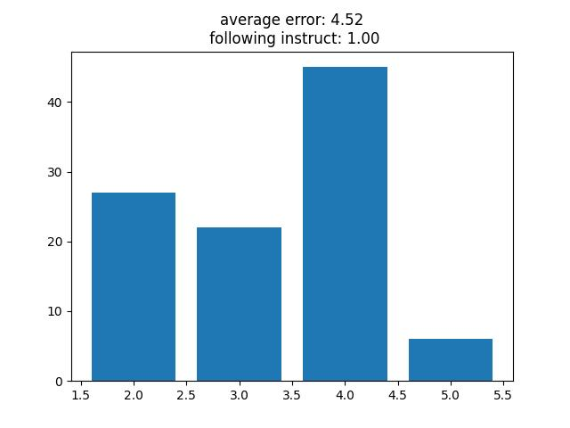
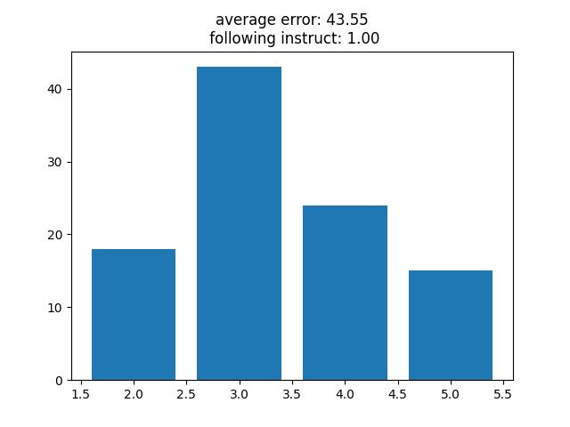

# Introduction
This is a simple **DPO(Direct Preference Optimization)** train demo, hoping it can help you quickly understand DPO and get start to dpo training.

## Task
Our defined task is to let the model to predict a series of number which the sum of these numbers is equal to our input.

Such as we input `"100"` and the model output `"50+50"`, `10+10+10+70`,which the sum of these numbers is equal to our input.

## SFT model Train

We randomly generate a series of datas like `100=50+50` `43=10+30+3` as training datas. Then we train a `Transformer` architecture from scratch.

## DPO Train

### train target

We want our model to output the sum of the target with specifical numbers. For example, we only want our model use three numbers to represent the sum of target. And the we can generate positive and negative pair as following examples.

|positive  | negative |
|-|-|
|100=10+70+20|100=40+60|
|100=10+70+20|100=20+20+20+40|
|100=10+70+20|100=20+20+20+20+20|

After DPO traing, we expect that model output the sum of the target with specifical number of nubmers.

### training loss

We utilize the basic Maximum Likelihood Estimation to optimize the model.

$$Loss = -log\sigma(\beta((P_{accept} - P_{reject}) - (P_{ref_{accept}} - P_{ref_{reject}})))$$

Here, $\beta = 0.8$

## Metrics

We evaluate the performance of model in two aspects, *average error of the sum of the prediction* and *format of the model ouput*. We hope the sum of the model output gets close the target as possible. Besides, the model should still have the previous instruct following ability.

`average error of the sum of the prediction`: we will evaluate the sum of the output with the target using *mean average error*.

`format of the model ouput`: we hope the format of the output can be parsed by fixed rules.

## Results

We prefer the model to represent the target as a sum of three number.

### SFT results

### DPO result 

## Conclusion

After DPO training, the model is easier to give the results the we prefer to. However, the performance shows a decline in average error.
